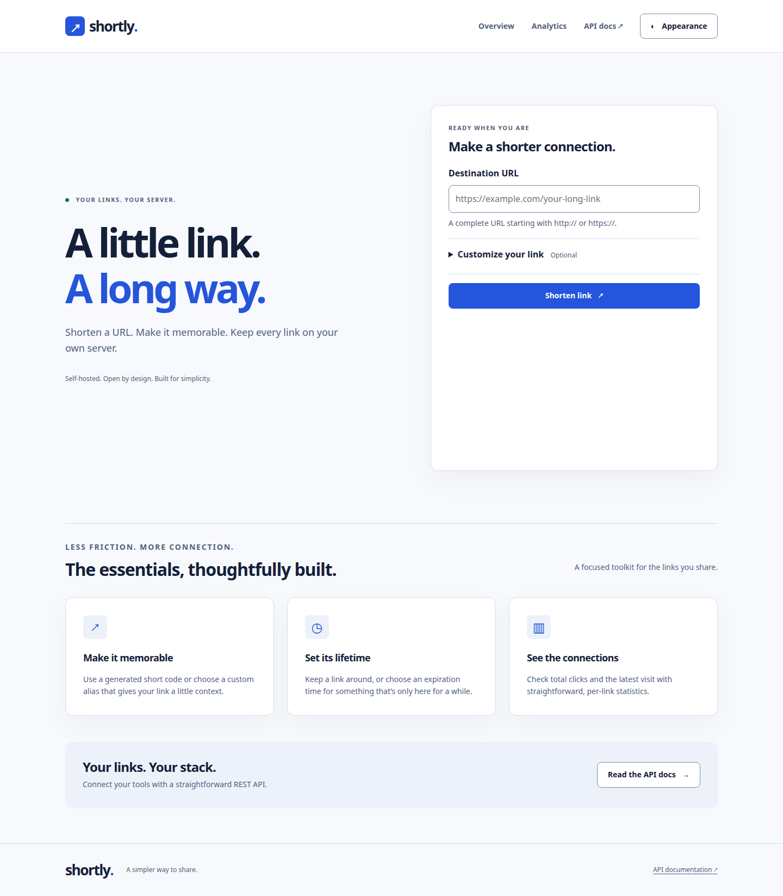
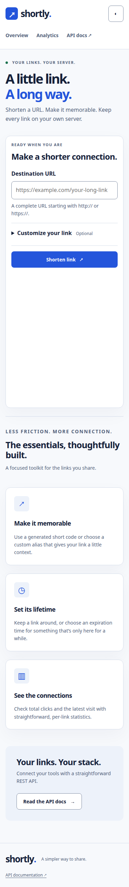

# URL Shortener

A self-hosted URL shortener API built with Java 25, Spring Boot 4+, PostgreSQL, and Docker.

> New here? Read `docs/PROJECT_OVERVIEW.md` for what/why, `docs/ARCHITECTURE.md` for how it's built, and `AGENTS.md` if you're an AI agent (or a human) picking up tickets.

## Features

Current API: `POST /api/v1/urls` validates an HTTP/HTTPS destination and returns a
created short link with an ID-based Base62 code or a custom alias. Aliases are
case-sensitive and must match `[a-zA-Z0-9_-]{3,16}`; invalid aliases return HTTP 400
and occupied aliases return HTTP 409. An optional future `expiresAt` timestamp is
saved and returned; omit it or set it to `null` for no expiry. Past or present expiry
returns HTTP 400. `GET /{shortCode}` redirects active links with HTTP 302 and records click count
and last access. Unknown links return 404; expired links return 410 without
changing analytics. `GET /api/v1/urls/{shortCode}` returns metadata and analytics for active or
expired links without recording a visit. `DELETE /api/v1/urls/{shortCode}` removes
a link and its analytics, returning 204; unknown or already-deleted codes return 404. See `docs/API_REQUESTS.md` for the implemented contract.

Planned full feature set:
- Shorten a URL to a short code (auto-generated, Base62) or a custom alias.
- Optional expiration on links.
- Redirect endpoint with click analytics.
- OpenAPI/Swagger docs.
- Fully containerized (Docker Compose: app + PostgreSQL).

## Tech stack
| | |
|---|---|
| Language | Java 25 |
| Framework | Spring Boot 4+ (Web, Data JPA, Validation, Actuator) |
| Database | PostgreSQL |
| Migrations | Flyway |
| Build | Maven 3.9+ |
| Testing | JUnit 6, Mockito, AssertJ, Testcontainers |
| Docs | springdoc-openapi |
| Container | Docker / Docker Compose |

## Quick start

### Run everything in Docker
```bash
git clone <repo-url> && cd url-shortener
cp .env.example .env
docker compose up --build
```
API is now at `http://localhost:8080`, Swagger UI at `http://localhost:8080/swagger-ui.html`.

### Run locally (DB in Docker, app on host)
```bash
cp .env.example .env
set -a
. ./.env
set +a
docker compose up -d postgres
mvn spring-boot:run
```

Compose reads `.env` automatically; Maven needs the variables exported as above.
If host ports are occupied, change `POSTGRES_PORT` / `APP_PORT` in `.env`.
For a host-run app, also update `POSTGRES_URL` to match `POSTGRES_PORT`.
Set `APP_BASE_URL` to the app's public origin. The containerized app always
connects to `postgres:5432` inside the Compose network.

Check startup with `curl --fail http://localhost:8080/actuator/health`
(adjust the port when using `APP_PORT`). Expect HTTP 200 and status `UP`.

### Run tests
```bash
mvn clean verify           # full suite (unit + integration, needs Docker for Testcontainers)
mvn test -Dgroups=unit     # unit tests only, fast, no Docker
```

The bootstrap integration tests start an isolated PostgreSQL container on a random
port using Testcontainers. A running Docker daemon is required; a pre-existing
database or `.env` file is not required for `mvn clean verify`.

## Docker build and CI

The Dockerfile builds the JAR with Maven and runs it as a non-root user in a
Java 25 Alpine JRE image. Its health check calls `/actuator/health`.
Use `docker compose up --build --wait --wait-timeout 180` to wait for both
PostgreSQL and the app to become healthy. The database uses a named volume.

`.github/workflows/ci.yml` runs on every pull request, pushes to `main`, and manual
workflow dispatch. It installs Temurin 25, caches Maven dependencies, and runs
`mvn --batch-mode --no-transfer-progress clean verify`, including Testcontainers.
A failed verification fails the job. It then builds and starts Compose, checks
health, and cleans up the runner's containers and volumes. Container packaging
skips tests because the preceding verification step runs the full suite.

## Example usage
```bash
# Create a short URL
curl -X POST http://localhost:8080/api/v1/urls \
  -H "Content-Type: application/json" \
  -d '{"originalUrl": "https://example.com/some/long/path"}'

# Follow the short link
curl -i http://localhost:8080/<shortCode>

# Get stats
curl http://localhost:8080/api/v1/urls/<shortCode>
```
Full request/response reference: `docs/API_REQUESTS.md`.

## Interactive API documentation

Open `http://localhost:8080/swagger-ui.html` to explore the API and try requests.
The generated specification is at `http://localhost:8080/v3/api-docs`. It documents
all four business operations, request validation, success headers, and problem
responses. Adjust the host/port for your deployment.

## Project documentation
| File | Contents |
|---|---|
| `docs/PROJECT_OVERVIEW.md` | What this project is and isn't, scope, success criteria |
| `docs/ARCHITECTURE.md` | Layered architecture, data model, error handling, deployment |
| `docs/API_REQUESTS.md` | Every endpoint, request/response examples, error shapes |
| `docs/TICKETS.md` | Full backlog, one ticket per feature, with required unit tests |
| `docs/CODING_STANDARDS.md` | Java/Spring conventions used across the codebase |
| `docs/TESTING_STANDARDS.md` | Test stack, naming, coverage expectations |
| `AGENTS.md` | How an AI coding agent (or stand-in human) should work this repo |

## Contributing / picking up a ticket
1. Pick an open ticket from `docs/TICKETS.md`.
2. Follow the workflow in `AGENTS.md` §3.
3. `mvn clean verify` must pass before opening a PR.
4. Reference the ticket ID in the commit message and PR title.

## License
MIT (adjust as needed).

## Frontend development

The React + TypeScript frontend lives in `frontend/` and uses Vite with an
application-owned CSS design system (no UI component library). Install Node.js
24 LTS and npm alongside Java 25 and Maven.

```bash
# Start the backend with PostgreSQL as described above, then in another terminal:
cd frontend
npm ci
npm run dev
```

Open the Vite URL printed in the terminal (normally `http://localhost:5173`).
The development server proxies `/api`, `/ui`, `/swagger-ui`, and `/v3/api-docs` to
`http://localhost:8080`. Set `API_PROXY_TARGET` when the local backend uses a
different address. Production uses same-origin relative URLs and needs no host
configuration. The creation page is at `/`; short codes keep their existing
redirect behavior. The landing page creates links; `/#/analytics` looks up a known short code.

```bash
# From frontend/:
npm run lint
npm run format:check       # npm run format applies formatting
npm test
npm run build             # type-checks and writes dist/
npm run preview           # previews assets only; does not proxy the API

# From the repository root:
mvn clean verify          # installs/builds frontend, runs frontend and Java checks
mvn spring-boot:run        # serves the generated frontend after the build
docker compose up --build # builds frontend and Java into one application image
```

Maven uses the new `exec-maven-plugin` to run the checked-in npm scripts, then
copies `frontend/dist/` into the application's static resources. Docker uses a
Node build stage and supplies those same assets to the Maven build, avoiding
Node in the runtime image. `-Dfrontend.skip=true` is for that prebuilt-assets
path only; normal verification should not skip frontend checks.

The reusable components are in `frontend/src/components/ui.tsx`. Design tokens
and responsive breakpoints are documented in `frontend/src/styles.css`.
Appearance follows the OS until explicitly toggled, with the choice saved in
local storage. Components support keyboard focus, reduced motion, and semantic
status/error feedback. `Modal` uses native `<dialog>` behavior for focus trapping
and restoration; `Toast` stays visible until dismissed. Fonts are system-local.

### Creating links

Enter an HTTP/HTTPS destination and select **Shorten link**. Expand **Customize
your link** for a case-sensitive alias (3–16 letters, digits, `_`, or `-`) and
an optional future expiry in your local time. The form converts expiry to UTC
for the API and omits empty optional fields. The server remains authoritative
for URL limits, uniqueness, and expiry. Input is retained after failures;
submission is disabled while awaiting a response. A result panel shows the confirmed link, destination, alias type, and expiry.
Copy the link or use native sharing when supported. If copying is unavailable
or denied, a selected text field provides a manual copy fallback. **Open link**
opens the redirect in a new tab; **View analytics** opens `/#/analytics?code=...` in a new tab with the
created link preselected.
**Shorten another** clears the form and result, then focuses the destination
field. Result data is kept only in memory; refreshing never repeats creation.

`GET /ui/config` supplies the public alias prefix from `APP_BASE_URL`, using the
same setting as generated links. It exposes no private configuration and avoids
embedding a production hostname in frontend assets. Set `APP_BASE_URL` to your
public short-link address, including when it differs from the frontend origin.

### Link analytics and deletion

Open **Analytics** or **View analytics** after creation. Look up a short code to
see its public URL, destination, click count, alias type, and timestamps. Dates
use your local timezone; hover for the exact ISO timestamp. Active/expired
status updates when expiry is reached while the page is open. Lookup never
opens the redirect or adds a click. This is a single-link lookup.

**Delete link** opens a dialog naming the exact code and explaining permanent
removal. Only **Delete permanently** sends DELETE. Before confirmation,
Cancel or Escape leaves the link untouched. After confirmation, Escape closes
the dialog but the submitted request continues; the page reports its outcome. Successful deletion clears
the result; failures allow explicit retry. No link data enters browser storage.

### Accessibility and production quality

See [Frontend quality checks](docs/FRONTEND_QUALITY.md) for browser tests,
Lighthouse thresholds, local commands, and report locations. The frontend uses
a strict nonce-based CSP, external scripts, bounded requests, safe recovery
messages, and an unexpected-error boundary. CI runs axe, keyboard/responsive
workflows, and Lighthouse against the packaged application.

## Observability

The `docker` profile writes one ECS JSON object per application log event to
stdout, using Spring Boot's built-in structured logging (no extra dependency).
The startup banner is disabled in this profile; local development retains readable
text logs. View container logs with `docker compose logs -f app`. JSON events
include `@timestamp`, nested `log.level`, `log.logger`, and `service.name` fields,
and `message`.
URL creation (generated codes and custom aliases), resolution, and deletion
are logged at INFO with the short code, without destination URLs or query tokens.
These service logs describe execution, not a durable transaction audit trail.

Actuator exposes health, info, and metrics at the existing `/actuator` base path:

```bash
curl --fail http://localhost:8080/actuator/metrics
curl --fail http://localhost:8080/actuator/metrics/jvm.memory.used
curl --fail http://localhost:8080/actuator/metrics/http.server.requests
```

HTTP request metrics appear after requests have been handled. The metrics endpoint
returns a JSON catalog and individual measurements; no Prometheus exporter is
configured. Other Actuator endpoints remain outside the exposure allowlist.

Format reference: [Spring Boot structured logging](https://docs.spring.io/spring-boot/reference/features/logging.html#features.logging.structured).

## Frontend architecture and deployment

The browser runs React + TypeScript with an application-owned CSS design system.
`AppShell` selects creation or analytics through hash routing; components call
same-origin REST endpoints through a bounded request helper. Spring Boot serves
the Vite build from the application jar with a strict CSP. Docker's final JRE
image contains the production assets; Node is used only during the build.
PostgreSQL runs separately. CI verifies the image contents and exercises the
containerized app through Playwright before running Lighthouse.

See [Frontend deployment](docs/FRONTEND_DEPLOYMENT.md) for runtime configuration,
local proxying, isolated CI reproduction, troubleshooting, and screenshot commands.
The analytics UI remains at `/#/analytics` to preserve the short-code namespace.

### Desktop (1440px)



### Mobile (375px)


