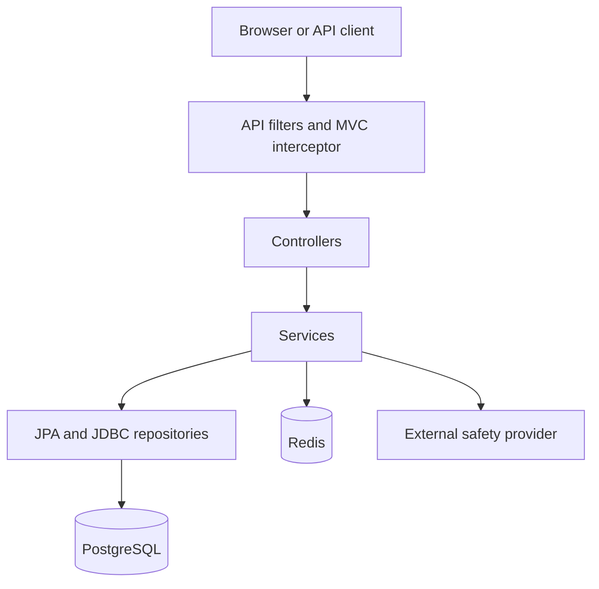

> Historical review of HEAD `a923df8`, followed by working-tree verification.
> Current follow-up: the frontend now supports memory-only V2 credentials,
> creation, analytics/deletion, shared QR access, and paginated My links.
> References below to an absent authenticated frontend describe the original review.
> Dashboard filters remain backlog. See README.md and docs/VERIFICATION_FOLLOWUP.md
> for the current behavior and validation.

# 1. Executive Summary

This project is a **self-hosted URL shortener with a React frontend and a Spring Boot REST backend**. It creates short links, redirects visitors, records basic click statistics, and provides authenticated management APIs, QR generation, Redis caching, request quotas, and submission-time link-safety checks.

It is a **layered monolith with an embedded SPA**:

- One Spring Boot executable JAR serves the API, redirects, frontend assets, and operational endpoints.
- PostgreSQL stores authoritative link, ownership, credential, and audit records.
- Redis supports redirect caching, distributed rate limiting, and cached safety verdicts.
- An operator-configured external HTTP service supplies malware/reputation verdicts.

The intended audience is an operator or small team wanting control over its links, infrastructure, and data. It is not yet a complete multi-user SaaS product: there is no account-registration flow, authenticated owner dashboard, billing, bulk creation, or time-series analytics.

**Current maturity:** the core application and F01/F02/F03/F05/F06 capabilities are substantially implemented and tested. Production operations, V1 retirement, and the authenticated frontend remain incomplete.

Three operational facts are particularly important:

1. **New links cannot activate without a working safety provider.** An empty scanner endpoint causes creation to fail closed.
2. **The main frontend still uses anonymous V1 creation, analytics, and deletion.** Only QR generation uses authenticated V2.
3. **Release verification is separate from Maven.** The browser localhost fixture has been corrected; see the follow-up for current browser/Lighthouse results.

This overview began as a read-only review of HEAD `a923df8`. Verification findings have since been addressed in the working tree; see docs/VERIFICATION_FOLLOWUP.md for changes and fresh validation. Existing frontend design changes remain uncommitted.
# 2. Complete Feature Inventory

| Feature | Status | Entry points and version | Implemented behavior and rules |
|---|---|---|---|
| URL shortening | Implemented | `POST /api/v1/urls`, `POST /api/v2/urls`; creation UI | Validates destination, optional alias, expiry, and safety before activation. Returns `201` and link metadata for safe destinations. V2 associates the authenticated owner. |
| Base62 generation | Implemented | Both creation APIs | Encodes the PostgreSQL-generated numeric ID using `0123456789ABCDEFGHIJKLMNOPQRSTUVWXYZabcdefghijklmnopqrstuvwxyz`. No padding, shuffle, or random public identifier. |
| Custom aliases | Implemented | Both creation APIs; optional UI field | Case-sensitive, 3–16 characters, letters/digits/underscore/hyphen. Globally unique across owners and generated codes. Duplicate aliases return `409`. |
| Expiration | Implemented | Both creation APIs; optional local-date UI field | Creation requires a future expiry. Expired redirects return `410`; metadata and deletion remain available. |
| Public redirects | Implemented | `GET /{shortCode}`; unversioned | Returns `302` with `Location` and `Cache-Control: no-store`. Only active, unexpired links redirect. |
| Click analytics | Implemented | Redirect service | Synchronously increments lifetime count and updates last-access timestamp in PostgreSQL. Cache hits still perform a database write. |
| Statistics | Implemented | V1/V2 `GET /urls/{shortCode}` | Returns destination, short URL, timestamps, alias flag, and total clicks without recording a click. |
| Deletion | Implemented | V1/V2 `DELETE /urls/{shortCode}`; analytics UI | Hard-deletes the link and its embedded analytics; attempts Redis eviction. Missing/foreign resources return `404`. |
| Error responses | Implemented | APIs, authentication, quota filters | Spring `ProblemDetail`, `application/problem+json`, safe domain messages, validation errors, and generic unexpected-error responses. |
| OpenAPI / Swagger | Implemented | `/v3/api-docs`, `/swagger-ui.html` | Documents V1/V2, API-key authentication, errors, quotas, QR, safety, and V1 deprecation. |
| Redirect cache | Implemented | Shared redirect path | Redis cache-aside destination lookup with expiry-aware TTL, eviction, metrics, and PostgreSQL fallback. |
| API-key authentication | Implemented | `/api/v2/**` | Custom servlet filter checks `X-API-Key`; stored credentials are hashes, not raw keys. |
| Ownership isolation | Implemented | V2 management | Owner comes from authentication. Foreign and nonexistent links both return `404`. V1 cannot manage owned links. |
| API-key lifecycle | Implemented | Operator script; V2 key endpoints | Provisioning, current-key rotation/revocation, last-used tracking, and transactional lifecycle audit records. |
| Rate limiting | Implemented, opt-in | Management APIs and redirects | Redis-backed atomic fixed windows; owner identity for V2, remote address for anonymous traffic; `429` and quota headers. |
| QR generation | Implemented | V2 PNG/SVG endpoints; `/#/qr` | Encodes the public short URL. Enforces ownership and bounded rendering options. No stored image blobs. |
| Link safety | Implemented with external dependency | Both creation APIs | Normalization, DNS/IP policy, synchronous provider call, cached verdicts, audit records, and fail-closed activation. |
| Creation UI | Implemented, V1 | `/` | Client validation, optional settings, pending states, duplicate-submit prevention, preserved input, and server-confirmed result. |
| Copy/share | Implemented | Creation result | Clipboard API with manual-copy fallback; optional Web Share API; safe new-tab links. |
| Analytics UI | Implemented, V1 | `/#/analytics?code=…` | Looks up one known code, displays counts/timestamps, and supports deletion. It is not an owner dashboard. |
| Delete confirmation | Implemented | Analytics UI | Native modal dialog, explicit confirmation, focus handling, duplicate-delete prevention, and uncertain-result messaging. |
| Theme support | Implemented | Header appearance control | System preference until explicit choice; light/dark preference persisted in local storage. |
| Responsive/accessibility support | Implemented; release verification needs attention | Shared UI and browser tests | Semantic controls, labels, focus states, live regions, skip link, reduced motion, modal keyboard handling, responsive CSS. |
| CSP | Implemented for frontend root | `GET /` | Fresh script nonce, strict script policy, same-origin resources, frame/object restrictions, no-referrer and nosniff headers. |
| Error boundary | Implemented | React root | Replaces rendering failures with a safe recovery page. |
| Frontend request handling | Implemented | Shared fetch wrapper | Deadline, cancellation, binary-safe response buffering, safe error messages, no automatic write retries. |
| E2E / Lighthouse | Implemented tooling; known test mismatch | CI and npm scripts | Production-server browser tests, axe scans, responsive/keyboard checks, and Lighthouse thresholds. |
| Structured logging | Implemented | Docker Spring profile | ECS JSON console output; business messages identify short codes rather than full destinations. |
| Actuator / metrics | Implemented | `/actuator/*` allowlist | Health, info, metrics, HTTP/JVM/pool metrics, and application counters. |
| Dockerized deployment | Implemented | Dockerfile and Compose | Three-stage image build; non-root JRE runtime; PostgreSQL and Redis services with health checks. |
| CI | Implemented, not verified green in this review | GitHub Actions | Maven verification, Docker smoke test, runtime-image inspection, Playwright, Lighthouse, artifacts, cleanup. |
| Continuous deployment | Not implemented | — | No registry publishing, deployment job, or production rollout automation found. |
| Owner listing/dashboard | Partially implemented, F07 | `GET /api/v2/urls` | Bounded pagination and deterministic ordering exist; filters and authenticated dashboard UI do not. |
| Operational audit/retirement | Partially implemented, F10 | Audit tables and sunset filter | Key/safety audits and optional V1 sunset exist; comprehensive link audit, dashboards, restore evidence, and enforced retirement do not. |
| Bulk creation | Backlog, F04 | No bulk endpoint | No batch processing or per-item batch results. |
| Time-series analytics | Backlog, F08 | No trend endpoints | No time buckets, retention policy, geographic/device analytics, or real trend charts. |
| Link lifecycle updates | Backlog, F09 | No update/deactivation endpoints | No destination editing, expiry editing, owner activation/deactivation, or optimistic version field. |

**Deprecated:** V1 management is explicitly deprecated but remains enabled unless a deployment configures its sunset.

**Inactive artifacts:** old root-level and MySQL migration files remain in the tree but are outside the configured Flyway location.

# 3. Backend Technology Stack

Versions below come from `pom.xml`, its cached parent/BOM, and the resolved classpath recorded in existing Surefire reports. Unless explicitly pinned, framework/transitive versions are resolved under **Spring Boot 4.0.0 dependency management**.

| Technology | Version | Purpose | Where Used |
|---|---|---|---|
| Java | Target **25**; inspected local JDK **25.0.4**, Ubuntu | Application language/runtime; records, HTTP client, cryptography, virtual-thread helpers | Backend and tests |
| Spring Boot | **4.0.0** | Auto-configuration, executable application, dependency management | Parent POM and application |
| Spring MVC / Spring Framework | **7.0.1** | Servlet REST controllers, validation integration, transactions, JDBC, testing | Web/service/config layers |
| Embedded Apache Tomcat | **11.0.14** | HTTP servlet server | Executable JAR |
| Spring Data JPA | **4.0.0** | Repository abstraction | `ShortUrlRepository` |
| Spring Data Commons / KeyValue | **4.0.0** | Shared data abstractions | JPA/Redis dependencies |
| Hibernate ORM | **7.1.8.Final** | Entity mapping and SQL persistence | `ShortUrl` |
| Jakarta Persistence API | **3.2.0** | JPA annotations/contracts | Domain/repository layer |
| Jakarta Transactions API | **2.0.1** | Transaction contracts | Persistence stack |
| Spring Validation starter | **4.0.0** | Validation integration | Request DTOs |
| Hibernate Validator | **9.0.1.Final** | Bean-validation implementation | URL/QR request validation |
| Jakarta Validation API | **3.1.1** | Validation annotations | DTOs |
| HikariCP | **7.0.2** | JDBC connection pooling | PostgreSQL datasource |
| PostgreSQL server | **17-alpine** image tag; patch not pinned | Authoritative storage | Compose and Testcontainers |
| PostgreSQL JDBC | **42.7.8** | Database connectivity | Runtime dependency |
| Spring Boot Flyway starter | **4.0.0** | Migration startup integration | Application startup |
| Flyway core | **11.14.1** | Versioned SQL migrations | Persistence |
| Flyway PostgreSQL module | **11.14.1** | PostgreSQL-specific support | Runtime migration engine |
| Spring Data Redis | **4.0.0** | Redis templates and connections | Cache, quotas, verdicts |
| Redis server | **8-alpine** image tag; patch not pinned | Disposable cache and distributed counters | Compose / Redis integration tests |
| Lettuce | **6.8.1.RELEASE** | Redis client | Spring Data Redis |
| Netty | **4.2.7.Final** | Client transport | Lettuce dependency |
| Reactor Core | **3.8.0** | Lettuce support | Transitive; application is not WebFlux |
| Reactive Streams | **1.0.4** | Reactive contracts | Transitive Redis stack |
| Jackson 3 | **3.0.2** | Main JSON serialization | Boot MVC and Redis JSON |
| Jackson 2 | Core/databind/modules **2.20.1**; annotations **2.20** | Compatibility dependencies | OpenAPI/Flyway transitive stack |
| SnakeYAML | **2.5** | YAML parsing | Configuration/dependencies |
| Springdoc OpenAPI | **3.0.0**, explicitly pinned | Generated API specification and Swagger integration | `OpenApiConfig` |
| Swagger core/models/annotations | **2.2.38** | OpenAPI model and annotations | Controller documentation |
| Swagger UI | **5.30.1** | Interactive documentation | WebJar |
| WebJars Locator Lite | **1.1.2** | WebJar resource resolution | Swagger UI |
| ZXing core | **3.5.4**, explicitly pinned | QR encoding and test decoding | `QrCodeService` |
| Spring Boot Actuator | **4.0.0** | Health and operational endpoints | Runtime |
| Micrometer | **1.16.0** | Application and infrastructure metrics | Services/cache/Actuator |
| SLF4J | **2.0.17** | Logging API | Business services |
| Logback | **1.5.21** | Logging backend | Runtime, ECS JSON output |
| Log4j API / SLF4J bridge | **2.25.2** | Dependency logging bridge | Transitive logging stack |
| AspectJ Weaver | **1.9.25** | Framework weaving support | Transitive persistence stack |
| Byte Buddy | **1.17.8** | Runtime enhancement/mocking | Hibernate/Mockito stack |
| ANTLR runtime | **4.13.2** | Query parsing | Hibernate dependency |
| JUnit Jupiter / Platform | **6.0.1** | Backend tests | Test sources |
| Mockito | **5.20.0** | Mocking | Unit/MVC tests |
| AssertJ | **3.27.6** | Fluent assertions | Tests |
| Spring Boot test starters | **4.0.0** | MVC, JPA, Flyway, general test support | Test dependencies |
| Spring Boot Testcontainers support | **4.0.0** | Container service connections | Integration tests |
| Testcontainers | **2.0.2** | PostgreSQL/Redis test infrastructure | Integration tests |
| Docker Java | **3.7.0** | Docker client | Testcontainers dependency |
| Awaitility | **4.3.0** | Async-test support available in test stack | Test dependency |
| Hamcrest | **3.0** | MVC/assertion support | Tests |
| JSONPath | **2.9.0** | Response assertions | MVC tests |
| JSONassert / XMLUnit | **1.5.3** / **2.10.4** | Structured document assertions | Test stack |
| Maven | Local **3.9.12**; Docker **3.9** tag | Build orchestration | Local/CI/container build |
| Exec Maven Plugin | **3.5.0** | Invokes npm lifecycle | Frontend build/checks |
| Spring Boot Maven Plugin | **4.0.0** | Executable JAR packaging | Package phase |
| Maven Compiler Plugin | **3.14.1**, inherited | Java compilation | Build |
| Maven Resources Plugin | **3.3.1**, inherited | Resource/frontend copying | Build |
| Maven Surefire Plugin | **3.5.4**, inherited | Runs Java tests | Test phase |
| Maven JAR Plugin | **3.4.2**, inherited | JAR construction | Build |
| Maven Clean Plugin | **3.5.0**, inherited | Build cleanup | Clean lifecycle |
| Maven Dependency Plugin | **3.9.0**, inherited | Offline dependency preparation | Docker build |
| JaCoCo Maven Plugin | **0.8.14** | Coverage instrumentation/report | Test/verify |

The Actuator starter appears twice in `pom.xml`; this is a duplicate declaration, not two separate capabilities.

There is **no Spring Security dependency**. Authentication is implemented directly with a servlet filter and application services.

# 4. Frontend Technology Stack

The application package is `url-shortener-frontend` **0.1.0**, private, using ECMAScript modules.

The following are **lockfile-resolved versions**, which sometimes differ from the minimum versions written in `package.json`.

| Technology | Version | Purpose | Where Used |
|---|---|---|---|
| React | **19.3.0** | UI components and hooks | Production dependency |
| React DOM | **19.3.0** | Browser rendering | Production dependency |
| TypeScript | **5.9.3** | Static typing and build checks | Development |
| Vite | **7.3.6** | Development server and production bundling | Development/build |
| Vite React plugin | **5.2.0** | React transform integration | Vite |
| Node.js | Engine **≥22.12.0**; CI/Docker **24**; local **24.19.0** | Build/test runtime | Not production application runtime |
| npm | Local **11.17.0**; repository does not pin exact npm version | Dependency installation/scripts | Build |
| Rollup | **4.63.1** | Bundling | Vite transitive dependency |
| esbuild | **0.28.2** | Build transforms | Transitive dependency |
| ESLint / `@eslint/js` | **9.39.5** | Linting | Development/CI |
| typescript-eslint | **8.70.0** | TypeScript lint support | ESLint |
| React Hooks ESLint plugin | **7.1.1** | Hooks correctness rules | ESLint |
| globals | **16.5.0** | Environment globals | ESLint |
| Prettier | **3.9.6** | Formatting checks | Development/CI |
| Vitest | **4.1.11** | Unit/component test runner | Development |
| jsdom | **27.4.0** | DOM test environment | Vitest |
| Testing Library React | **16.3.3** | User-oriented component tests | Tests |
| Testing Library user-event | **14.6.7** | Input/keyboard interaction simulation | Tests |
| Testing Library jest-dom | **6.9.1** | DOM matchers; used with Vitest | Tests |
| Playwright Test | **1.63.0** | Real-browser testing | E2E/CI |
| axe-core / axe Playwright adapter | **4.13.0** | Accessibility scans | Browser tests |
| Lighthouse CI | **0.15.1** | Automated quality thresholds | CI |
| Lighthouse | **12.6.1** | Performance/accessibility/best-practice/SEO audits | LHCI dependency |
| React / React DOM types | **19.3.0** | Type declarations | Development |
| Node types | **24.13.4** | Tooling type declarations | Development |
| Plain CSS and SVG | No package version | Design tokens, themes, responsive layout, illustrations | Production assets |
| Browser APIs | Browser-provided | Fetch, abort, clipboard, sharing, dialog, storage, media queries, object URLs | UI implementation |

Only React and React DOM are declared production npm dependencies. Build, lint, test, and audit packages are development dependencies.

There is no React Router, Redux, TanStack Query, Axios, Tailwind, Bootstrap, component framework, or charting dependency. The decorative homepage chart is SVG artwork, not implemented time-series analytics.

The npm lockfile uses format version **3**; that does not specify the npm executable version.

# 5. Database and Persistence

PostgreSQL is the source of truth for all durable application state.

**Persistence mechanisms**

- `ShortUrl` is a JPA entity managed by Hibernate.
- `ShortUrlRepository` uses Spring Data JPA.
- API-key and safety-audit repositories use `JdbcTemplate`.
- Service methods establish transaction boundaries.
- `spring.jpa.open-in-view=false` prevents lazy database work from leaking into response rendering.
- `ddl-auto=validate` validates mappings; Flyway owns schema changes.

**Stored data**

| Table | Responsibility |
|---|---|
| `short_url` | Code, normalized destination, alias flag, creation/expiry/access timestamps, total clicks, optional owner, safety state/provider/scan time |
| `api_owner` | Operator-created owner UUID and creation timestamp |
| `api_key` | Non-secret prefix, owner, SHA-256 credential hash, creation/use/revocation timestamps |
| `api_audit` | Key lifecycle events and actor/target prefixes |
| `safety_audit` | Destination hash, provider, verdict, scan timestamp, cache-use flag, recording timestamp |

There are no per-click event records, visitor identities, time-series buckets, user profiles, or stored QR images.

**Concurrency and locking**

- Redirect misses use a pessimistic row lock before updating analytics.
- Redirect cache hits use an atomic conditional database update.
- Deletion uses a locked lookup.
- Authentication locks the key row and updates last-used time.
- Key rotation is transactional and serialized to prevent multiple successful replacements.
- Database uniqueness is the final protection against alias races.
- There is no optimistic `@Version` field for future link editing.

**Indexes and constraints**

- Unique short-code constraint.
- Owner foreign keys.
- API-key prefix primary key and owner index.
- Composite link index on owner, creation time descending, and ID descending.
- Safety-state/verdict check constraints.
- Safety-audit index on destination hash and recording time.

Deleting a link removes its stored aggregate analytics but does not delete the independent safety-audit history.

### Flyway migrations

The configured location is **`classpath:db/migration/postgres`**.

| Migration | Purpose | Important Schema Changes |
|---|---|---|
| `postgres/V1__create_short_url.sql` | Initial active PostgreSQL schema | Identity `BIGINT` ID; unique 16-character code; destination text; alias flag; timestamps; click count default zero. Initial timestamps lack time zones. |
| `postgres/V2__api_key_ownership.sql` | Authentication and ownership | Adds `api_owner`, `api_key`, `api_audit`; nullable owner FK on links; key-owner and owner-listing indexes. Existing links remain unowned. |
| `postgres/V3__restore_short_url_timestamp_contract.sql` | Correct timestamp/default contract | Converts link timestamps to `TIMESTAMPTZ`, interpreting existing values as UTC; adds creation/alias defaults; renames short-code constraint to `uq_short_url_short_code`. |
| `postgres/V4__link_safety.sql` | Safety state and audit | Adds `PENDING/ACTIVE/REJECTED/SCAN_FAILED`, provider and scan time; creates safety audit/index; marks previous links `ACTIVE` with provider `legacy-unscanned`. |
| Root `V1__create_short_url_table.sql` | Retained older PostgreSQL migration | Uses `BIGSERIAL`, timezone-aware timestamps/defaults, and a unique index. **Not active under current configuration.** |
| `mysql/V1__create_short_url.sql` | Retained MySQL variant | MySQL auto-increment and timestamp schema. **Not active; current runtime has no MySQL driver/module configuration.** |

Changing Flyway to scan the parent migration directory would encounter multiple V1 migrations. Existing deployments should verify their recorded migration history before changing migration locations.

# 6. Backend Architecture

The backend uses package-by-layer organization:

| Layer/package | Responsibility |
|---|---|
| `controller` | HTTP mappings, request validation, service calls, response status/headers |
| `service` | URL rules, ownership, transactions, authentication lifecycle, quotas, QR rendering, safety orchestration |
| `repository` | JPA queries and explicit JDBC persistence |
| `domain` | `ShortUrl` entity and `SafetyState` |
| `dto` | Request/response records; entities are not API responses |
| `exception` | Domain failures and safe HTTP error mapping |
| `config` | Redis, safety, quotas, API filters, OpenAPI, application wiring |
| `security` | API-key filter, owner principal, V1 deprecation filter, quota interceptor |
| `cache` | Redirect-cache abstraction and Redis implementation |
| `safety` | Provider abstraction, HTTP adapter, address-resolution abstraction |
| `util` | Base62 conversion |

The primary dependency direction is:



This is a layered monolith rather than strict hexagonal or clean architecture. Services directly use Spring transactions, repositories, Redis templates, and framework types. Some boundaries—such as `SafetyProvider` and `RedirectCache`—are abstracted, but there is no framework-independent application core with adapters around every dependency.

That choice keeps a relatively small application understandable and avoids excessive abstraction, at the cost of tighter framework coupling.

# 7. Request Flows

### Create URL

1. Client submits destination, optional alias, and optional expiry.
2. V2 authenticates the API key; V1 remains anonymous.
3. If enabled, management quota is consumed.
4. Controller applies DTO validation.
5. Service checks URL shape/length, expiry, alias syntax, and uniqueness.
6. Safety policy normalizes the URL and validates DNS/IP destinations.
7. Safety service obtains a cached verdict or calls the provider.
8. An independent safety-audit transaction records the assessment.
9. Service saves the link with its resulting safety state.
10. An active link returns `201`.

For generated codes, the service first inserts an internal temporary code, obtains the database ID, converts it to Base62, and updates the row within the transaction.

Failure paths differ:

- Invalid URL/private destination: `400`, before link creation.
- Duplicate alias: `409`.
- DNS unavailable: `503`, before link insertion.
- Malicious verdict: saves `REJECTED`, then returns `422`.
- Scanner failure: saves `SCAN_FAILED`, then returns `503`.
- Audit persistence failure: prevents activation.

Rejected/failed creations can therefore **reserve a code or alias despite an error response**.

### Redirect

1. Public request reaches `RedirectController`.
2. Optional redirect quota is checked.
3. Service reads the Redis destination cache.
4. On a usable hit, PostgreSQL atomically increments analytics only if the row is still active and unexpired.
5. If that update succeeds, the cached destination is returned.
6. On miss/stale entry, service performs a locked database lookup, validates state/expiry, records access, and fills Redis.
7. Transaction commits before the controller returns `302`.

Unknown/inactive links return `404`; expired links return `410`. Redis failure falls back to PostgreSQL. PostgreSQL failure prevents successful redirect completion because analytics are synchronous.

### Authenticated V2 request

1. Filter recognizes `/api/v2` and its descendants.
2. It requires one valid `X-API-Key` header.
3. Service parses the prefix, locks its key record, compares credential hashes, and checks revocation.
4. Last-used time is updated.
5. Owner UUID and key prefix are attached as a request principal.
6. Quota interceptor uses owner identity.
7. Controller/service enforce owner isolation.

Invalid credentials return `401` before management quota processing. Foreign link access returns `404`. Attempting to rotate/revoke a different key prefix returns `403`.

### QR generation

1. API authentication and owner management quota.
2. Validate image size, margin, and correction level.
3. Fetch owned link metadata.
4. Construct the configured public short URL.
5. ZXing produces QR modules; application renders PNG or restricted SVG.
6. Return explicit image type and protective headers.

It does not follow the destination, increment analytics, or store image data. Expired/inactive owned records can still produce QR images because this flow uses metadata rather than redirect resolution.

### Deletion

1. Authenticate if V2; consume applicable quota.
2. Lock the link row.
3. Enforce owner or V1-unowned access.
4. Delete the row.
5. Attempt cache eviction.
6. Commit and return `204`.

Concurrent repeated deletes produce one success and a subsequent `404`.

# 8. API Surface

Paths below are the implemented application routes.

| Method | Endpoint | Version | Purpose | Auth | Response |
|---|---|---|---|---|---|
| POST | `/api/v1/urls` | V1, deprecated | Create unowned link | None | `201` + metadata/Location |
| GET | `/api/v1/urls/{shortCode}` | V1, deprecated | Read unowned link statistics | None | `200` |
| DELETE | `/api/v1/urls/{shortCode}` | V1, deprecated | Delete unowned link | None | `204` |
| POST | `/api/v2/urls` | V2 | Create owned link | API key | `201` |
| GET | `/api/v2/urls` | V2 | List owner’s links | API key | `200` paginated object |
| GET | `/api/v2/urls/{shortCode}` | V2 | Owned statistics | API key | `200` |
| DELETE | `/api/v2/urls/{shortCode}` | V2 | Delete owned link | API key | `204` |
| POST | `/api/v2/keys/{prefix}/rotate` | V2 | Replace current key | Current API key | `200`, new key shown once |
| DELETE | `/api/v2/keys/{prefix}` | V2 | Revoke current key | Current API key | `204` |
| GET | `/api/v2/urls/{shortCode}/qr.png` | V2 | PNG QR image | Owner API key | `200 image/png` |
| GET | `/api/v2/urls/{shortCode}/qr.svg` | V2 | SVG QR image | Owner API key | `200 image/svg+xml` |
| GET | `/{shortCode}` | Unversioned | Redirect | None | `302` |
| GET | `/` | UI | SPA HTML with CSP nonce | None | `200 text/html` |
| GET | `/assets/*` | UI | Production assets | None | Static resources |
| GET | `/ui/config` | UI | Public base URL | None | `200 {"publicBaseUrl":…}` |
| GET | `/actuator/health` | Operations | Health | No application API-key requirement | Health response |
| GET | `/actuator/info` | Operations | Application information | No application API-key requirement | Info response |
| GET | `/actuator/metrics` | Operations | Metric catalog | No application API-key requirement | JSON |
| GET | `/actuator/metrics/{name}` | Operations | Metric measurements | No application API-key requirement | JSON |
| GET | `/v3/api-docs` | Documentation | OpenAPI JSON | None | JSON specification |
| GET | `/swagger-ui.html` | Documentation | Swagger UI entry | None | UI redirect/resources |

Spring MVC also supports HEAD handling for GET mappings.

**Pagination:** zero-based `page`, default `0`; `size`, default `20`, permitted `1–100`. Ordering is `createdAt DESC, id DESC`. Response includes `content`, `page`, `size`, and `totalElements`.

**QR parameters:** `size=256`, `margin=4`, `correction=M` by default. Allowed size `128–1024`, margin `4–8`, correction `L/M/Q/H`.

**V1 deprecation:** responses advertise deprecation from **2026-09-17**. `APP_V1_SUNSET` optionally supplies a retirement deadline and Sunset header. After the deadline, V1 management returns `410`; public redirects remain available. There is no default retirement date.

# 9. Security Architecture

### API keys and authorization

The credential format is:

```text
usk_<24 lowercase hex characters>_<64 lowercase hex characters>
```

The prefix comes from 12 random bytes; the secret portion from 32 random bytes. SHA-256 of the complete credential is stored.

Authentication uses `MessageDigest.isEqual` for hash comparison, including a dummy comparison when no record exists. This protects the comparison itself; it does not make the entire database-backed request constant-time.

Keys are provisioned through `scripts/provision-api-key.py`, using Python cryptographic randomness and `psql`. The script commits the owner/key/audit transaction before displaying the full credential. It can provision a replacement for an existing owner.

There is no public registration/key-creation endpoint.

V2 ownership comes exclusively from the authenticated principal. Clients cannot choose another owner in a request body. Foreign records are concealed with `404`.

Rotation/revocation operates on the **currently authenticated key**, not arbitrary keys belonging to the same owner. Rotation atomically revokes the old credential and creates its replacement. Already-authenticated in-flight requests can still complete after revocation.

### Credential and audit handling

- Raw API keys are not stored in PostgreSQL.
- Credential-bearing object representations are redacted.
- V2 responses use `Cache-Control: no-store`.
- Key events record owner and non-secret prefixes.
- Last-used tracking occurs during authentication, including requests later rejected by quotas.
- Audit tables are application-maintained; database-level tamper-proof immutability is not implemented.

### Browser security

The frontend root supplies:

- A fresh random nonce for trusted scripts.
- `script-src 'nonce-…' 'strict-dynamic'`.
- Restricted same-origin styles/fonts/connections.
- Images from self and blob URLs.
- `object-src 'none'`, `base-uri 'none'`, and `frame-ancestors 'none'`.
- `Referrer-Policy: no-referrer`.
- `X-Content-Type-Options: nosniff`.

React text rendering avoids inserting response content as HTML. New-tab links use `noopener noreferrer`. SVG QR output contains generated geometry rather than untrusted markup.

These headers are applied by the root HTML controller; they are not a global security-header filter for every endpoint.

### URL and infrastructure controls

URL safety rejects embedded credentials, unsupported schemes, private/reserved addresses, disallowed CIDRs, and unusable scanner responses.

Rate-limit identifiers use HMAC-SHA256, rather than storing raw client addresses or owner UUIDs in quota keys.

A `CorsConfigurationSource` bean declares localhost Vite access, but no explicit CORS filter, MVC registration, or Spring Security consumer was found. Same-origin production and the Vite proxy work independently of that bean; cross-origin behavior should not be assumed configured.

**Remaining exposure:** anonymous V1 permits anyone knowing an unowned code to read its metadata or delete it. Base62 codes are enumerable. Deprecation alone does not remove that behavior.

# 10. Redis Architecture

Redis has three distinct responsibilities.

| Responsibility | Key structure | Value | Failure behavior |
|---|---|---|---|
| Redirect cache | `url-shortener:redirect:{shortCode}` | Full destination and expiry | Fall back to PostgreSQL |
| Rate limiting | `rate-limit:v1:{category}:{limit}:{windowSeconds}:{hmac}` | Count with window TTL | Management fails closed; redirects fail open |
| Safety verdict cache | `safety:v1:{providerRevision}:{urlSha256}` | State and original scan timestamp | Call provider instead |

### Redirect cache

It uses cache-aside reads and JSON serialization.

For permanent links, TTL defaults to **one hour**. For expiring links, TTL is the remaining lifetime; it is not necessarily the smaller of remaining lifetime and the permanent-link TTL. Nonpositive TTLs are not cached.

Deletes and detected stale/expired entries trigger eviction. Runtime Redis failures are caught and counted.

Every cache hit still performs an atomic PostgreSQL analytics update conditioned on active/unexpired state. Consequently, Redis does not authorize a redirect independently.

### Rate limiting

A Lua script atomically reads/creates/increments counters and handles TTL. The window starts with the first admitted request. Rejected requests do not extend the window or continue incrementing the count.

Categories separate management traffic and redirects. Owner quotas are shared across that owner’s keys. Changing the policy, HMAC secret, or losing Redis state effectively creates fresh buckets.

Management Redis failures return `503` with `Retry-After`; redirects proceed without quota enforcement.

### Verdict cache

Only definitive safe/malicious assessments are cached. Failed scans are not cached. Cached timestamps must be valid, not future-dated, and within the configured freshness period.

DNS/IP policy runs again before using a cached verdict.

**Privacy distinction:** redirect cache values contain full destination URLs. The privacy-minimized quota and verdict namespaces do not make Redis as a whole free of destination data.

Redis stores no authoritative click totals, raw API keys, or durable ownership records.

# 11. Link Safety Architecture

The safety pipeline is synchronous and shared by V1 and V2 creation.

### Normalization and address policy
`DestinationPolicy`:
- Accepts HTTP and HTTPS only.
- Requires a usable host.
- Rejects URL credentials and invalid ports.
- Lowercases scheme/host.
- Removes a trailing hostname dot.
- Removes default ports.
- Normalizes dot segments.
- Uses `/` for an empty path.
- Removes fragments.
- Preserves encoded path/query information.
- Rejects IPv6 zone identifiers and suspicious alternative numeric IPv4 forms.
- Enforces a 2,048-character limit.

DNS resolution checks **all returned addresses**. If any answer is blocked, the destination is rejected. Resolution is bounded using a virtual-thread task and a two-second wait.

Built-in restrictions include Java local/loopback/link-local/site-local/multicast classifications and explicit CIDRs:

| Address family | Explicit ranges |
|---|---|
| IPv4 | `0/8`, `10/8`, `100.64/10`, `127/8`, `169.254/16`, `172.16/12`, `192.168/16`, `192.0.0/24`, `192.0.2/24`, `198.18/15`, `198.51.100/24`, `203.0.113/24`, `224/4`, `240/4` |
| IPv6 | `::/96`, `::1/128`, `fc00/7`, `fe80/10`, `ff00/8`, `2001:db8/32`, `2002/16`, `64:ff9b::/96` |
`SAFETY_BLOCKED_CIDRS` adds deployment-specific ranges; it does not replace mandatory blocks.
### Scanner contract

The HTTP adapter sends:

```http
POST <configured scanner endpoint>
Content-Type: application/json
Authorization: Bearer <token>    # when configured

{"url":"<normalized destination>"}
```

The expected response is HTTP `200`, JSON content type, and a recognized verdict:

```json
{"verdict":"SAFE"}
```

or:

```json
{"verdict":"MALICIOUS"}
```

The adapter:

- Uses the JDK HTTP client.
- Does not follow provider redirects.
- Makes one application-level attempt.
- Bounds timeout between 100 ms and 10 seconds; default is two seconds.
- Includes response-body completion in deadline handling.
- Caps response content at 4,096 bytes.
- Rejects bad status, invalid content type, malformed/unknown verdicts, oversized bodies, and timeouts.

There is no bundled commercial reputation feed or local malware engine. The CI scanner is a fixture that accepts HTTPS `example.com` destinations; it is not production protection.

### Verdicts, persistence, and audit

| Outcome | Stored link state | HTTP result |
|---|---|---|
| Provider SAFE | `ACTIVE` | `201` |
| Provider MALICIOUS | `REJECTED` | `422` |
| Provider unavailable/untrusted response | `SCAN_FAILED` | `503` |
| Initial/default state | `PENDING` | Cannot redirect |

Audit records contain normalized URL SHA-256, provider revision, state, original scan time, cache flag, and database recording time.

Audit writes use a separate `REQUIRES_NEW` transaction, so they survive failure/rollback of the surrounding operation. Failure to record the audit prevents activation.

The provider revision is operator-controlled. Changing provider, endpoint, or reputation policy should change this revision to invalidate old verdict keys.

### Legacy behavior and limits

V4 marks preexisting links active with `legacy-unscanned`; it does not claim they passed scanning or schedule them for rescanning.

Only `ACTIVE` links redirect. Verdict-cache expiry does not automatically deactivate an already-created link.

There is no asynchronous worker, periodic rescan, quarantine workflow, or redirect-time DNS verification. DNS rebinding, later destination changes, or a page becoming malicious after creation remain outside the submission-time guarantee. A scanner that fetches destinations must implement its own safe fetching and redirect policy.

Fragments are removed during normalization, which can change anchor-specific destination behavior.

# 12. Frontend Architecture

The frontend is a React SPA embedded in the backend deployment.

### Structure and routing
`main.tsx` mounts:
```text
StrictMode
└── ApiErrorBoundary
    └── AppShell
        ├── CreateUrlForm → CreationResult
        ├── AnalyticsLookup
        └── QrCodePanel
```
`AppShell` owns navigation, header, theme control, main content, and footer. Routing uses `hashchange` with `useSyncExternalStore`.
- `/` → creation/home
- `/#/analytics` → known-code analytics
- `/#/analytics?code=…` → prefilled lookup
- `/#/qr` → authenticated QR workflow

Hash fragments are not sent to the server. This avoids treating frontend routes such as “analytics” as public `/{shortCode}` redirects.

### State and API communication

State is local React state, refs, and effects. No global state store or query cache exists.

The shared `apiRequest` wrapper:

- Uses native fetch and AbortController.
- Applies a 15-second default deadline across headers and body reading.
- Handles route cancellation.
- Preserves binary response bytes.
- Converts offline, timeout, quota, server, and network failures into known messages.
- Does not automatically retry writes.

Response-shape validation occurs in components. Aborted analytics lookups do not restore stale data after navigation.

### UI and design system

Shared components include Button, Input, Card, Alert, Spinner, Skeleton, Modal, and Toast.
`styles.css` supplies foundational tokens/layout/accessibility behavior. The current uncommitted `design.css` applies the newer visual presentation: gradients, translucent panels, decorative SVG assets, and updated responsive styling.
Decorative SVG backgrounds are emitted as external assets to comply with the self-only image CSP. The homepage chart and timer illustrations are decorative.

### Accessibility

Implemented support includes:

- Visible labels and connected hints/errors.
- Native keyboard-operable controls.
- Busy/disabled states.
- Live status/error announcements.
- Focused creation result and delete recovery.
- Native `<dialog>` with Escape handling, focus restoration, and tab containment.
- Skip link that preserves the hash route.
- Reduced-motion and forced-color support.
- Responsive layouts.

Automated accessibility checks are useful evidence, not proof of complete WCAG conformance.

### Workflows and limitations

Creation and analytics use V1. QR accepts an API key in a password field and uses V2 metadata plus PNG/SVG requests.

A QR preview consumes **three management requests**: metadata, PNG, and SVG. This matters when configuring quotas.

Only the theme preference is persisted by application code. Link data and API keys are not stored in local/session storage. QR keys stay in component memory; preview object URLs are revoked on replacement/cleanup.

Safety errors have no dedicated UI state. Analytics labels a link “Active” based on expiry alone because the API response does not expose safety state; this can misrepresent a retained rejected/failed record.

# 13. Build Architecture

### Local development

A host development environment needs:

- Java 25 and Maven.
- Node meeting the declared engine requirement and npm.
- PostgreSQL.
- Redis for normal cache/health behavior and quotas when enabled.
- A configured safety provider for successful creation.

Vite provides hot development at its local server. Its proxy forwards `/ui`, `/api`, `/swagger-ui`, and `/v3/api-docs` to `API_PROXY_TARGET`, defaulting to `http://localhost:8080`.

Public short URLs come from backend `APP_BASE_URL`, not the Vite origin.

Compose reads its environment interpolation file; a host-run Java process does not automatically load `.env` merely because it exists.

### Maven build

The [POM](/home/parvez-hossain/Downloads/url-shortener-scaffold/url-shortener/pom.xml) integrates frontend work through `exec-maven-plugin`:

1. `generate-resources`: `npm ci --no-audit --no-fund`.
2. `generate-resources`: TypeScript check and Vite build.
3. Resource processing: copy `frontend/dist` into classpath `static`.
4. Compile Java.
5. Test phase: Java tests plus frontend lint, formatting check, and Vitest.
6. Package executable Spring Boot JAR.
7. Verify phase: generate JaCoCo report.
   `frontend.skip=true` skips npm executions; it does not create missing frontend assets.

Maven does not install Node itself. There is no Maven wrapper. All Java test classes run through Surefire; no separate Failsafe execution is configured.

**JaCoCo generates a report but does not enforce a minimum coverage threshold.**

### Docker build

The [Dockerfile](/home/parvez-hossain/Downloads/url-shortener-scaffold/url-shortener/Dockerfile) has three stages:

| Stage | Base | Work |
|---|---|---|
| Frontend | `node:24-alpine` | Install locked dependencies, lint, format-check, test, build production assets |
| Java build | `maven:3.9-eclipse-temurin-25` | Prepare dependencies, copy backend and prebuilt frontend, package with Java tests/frontend executions skipped |
| Runtime | `eclipse-temurin:25-jre-alpine` | Copy executable JAR, run as non-root `app`, expose 8080, health-check Actuator |

Node and npm are not present in the final application runtime image. Production frontend source maps are disabled.

# 14. Docker and Docker Compose

**Dockerfile** defines the application image. **Docker Compose** defines how that image runs alongside infrastructure.

| Service | Configuration |
|---|---|
| `app` | Built locally; Docker Spring profile; internal port 8080; waits for healthy PostgreSQL and Redis |
| `postgres` | `postgres:17-alpine`; database/user/password from environment; named persistent volume |
| `redis` | `redis:8-alpine`; ping health check; no configured persistent volume |
| `safety-scanner` | CI overlay only; Node fixture, read-only mounted script, health check |

All three baseline services use `restart: unless-stopped`.

Default published host ports are app `8080`, PostgreSQL `5432`, and Redis `6379`. These mappings do not explicitly bind only to loopback.

PostgreSQL health uses `pg_isready`; Redis uses `redis-cli ping`. The app image checks `/actuator/health` with wget every ten seconds, with a startup allowance.

The CI overlay adds a scanner dependency and sets the application scanner endpoint to the fixture.

There are no Compose profiles, TLS ingress, production load balancer, Redis authentication/TLS settings, or backup service in the repository.

PostgreSQL and Redis are containerized in the supplied deployment. Host-run Spring Boot can target external services through configuration.

A healthy application does not demonstrate that its configured safety provider can scan real destinations.

# 15. CI/CD

The repository has one principal [GitHub Actions workflow](/home/parvez-hossain/Downloads/url-shortener-scaffold/url-shortener/.github/workflows/ci.yml).

**Triggers:** pull requests, pushes to `main`, and manual dispatch.

**Environment and actions**

- `ubuntu-latest`; job timeout 25 minutes.
- `actions/checkout@v7`, credential persistence disabled.
- `actions/setup-java@v6`, Temurin Java 25, Maven cache.
- `actions/setup-node@v4`, Node 24, npm cache keyed through the frontend lockfile.
- `actions/upload-artifact@v4`.
- Read-only repository-content permissions.

**Execution**

1. Run `mvn clean verify`.
2. Build/start Compose with the CI scanner overlay and wait for health.
3. Inspect the final runtime image with Python.
4. Check application health.
5. Install Playwright Chromium and Linux browser dependencies.
6. Set `CHROME_PATH`.
7. Run Playwright release/accessibility/responsive tests.
8. Run Lighthouse thresholds.
9. Upload browser/audit reports even on failure.
10. Print container logs on failure.
11. Remove CI containers and volumes unconditionally.

The runtime-image check verifies the JAR contains production HTML/JS/CSS and excludes frontend source, source maps, development references, and Node/npm tooling.

Testcontainers supplies real PostgreSQL/Redis during Java integration testing, using the CI runner’s Docker capability.

**Corrected fixture:** `release.spec.ts` now submits a public example.com destination and fetches and checks the real 302 on short-link navigation without following it. Real application redirects and analytics remain exercised.

No image publishing or automated production deployment is implemented.

# 16. Testing Strategy

### Backend

The repository contains unit, MVC, persistence, real-HTTP, migration, and concurrency tests.

| Test area | Evidence |
|---|---|
| URL business rules | Creation, aliases, expiry, ownership, stats, deletion, cache behavior, safety outcomes |
| Base62 | Encoding/decoding and invalid/overflow cases |
| MVC controllers | Status codes, DTO validation, error contracts, authentication/authorization integration |
| Repository tests | PostgreSQL persistence, uniqueness, foreign keys, code update, ownership |
| Migration test | Populated V1 upgraded through current migrations while preserving code/count/expiry/unowned status and legacy safety marking |
| Concurrency | Redirect click accounting, concurrent deletion, API-key rotation |
| Redis integration | Two limiter instances sharing one Redis quota under concurrent requests |
| Safety unit tests | Normalization/IP ranges, cache freshness, provider failures, audit failure |
| Scanner HTTP tests | Local HTTP server verifies request contract, invalid responses, size/time limits |
| Safety integration | Inactive links cannot redirect even with stale cache; error responses retain intended state/audit |
| QR | Ownership/options; PNG and generated SVG decode to expected public URL |
| Production frontend integration | Packaged frontend/config served through real Spring Boot |
| Observability/OpenAPI | Health, metric catalog, safe ECS logging, docs availability |

Pure unit and MVC tests do not need Docker. PostgreSQL/Redis Testcontainers tests do.

JUnit tags distinguish `unit` and `integration`; selecting tags does not automatically skip frontend Maven executions.

Fresh Maven verification reports **436 backend tests, zero failures, zero errors, zero skips**. This includes regression coverage for stale cached destinations and explicit quota defaults.

### Frontend

Nine unit/component test files cover:

- Form validation and payloads.
- Duplicate submissions and malformed responses.
- Copy/share and fallback behavior.
- Theme persistence and storage failures.
- Route selection.
- Analytics cancellation, expiry updates, deletion states.
- Native shared controls.
- Error-boundary recovery.
- QR binary handling, credentials, cleanup, and cancellation.
- Request timeout, offline handling, safe errors, and binary preservation.

Fresh frontend verification passed **81 tests across nine files**, alongside build, lint, and formatting checks.

Playwright defines **20 browser cases** after expanding width/theme/fault loops. Coverage includes six viewport widths, keyboard workflows, modal focus, axe scans, CSP rejection of untrusted inline script, transport faults, and real API operations.

There is no checked-in QR browser E2E scenario comparable to the creation/analytics release flows.

### Quality gates

| Gate | Actual enforcement |
|---|---|
| Java compilation/tests | Maven verify |
| TypeScript | `tsc -b` during frontend build |
| Frontend lint | ESLint |
| Frontend formatting | Prettier check |
| Frontend component tests | Vitest |
| Backend coverage | JaCoCo report only |
| Java formatting | No configured Spotless/Checkstyle gate |
| Frontend coverage | No configured percentage gate |
| Browser accessibility | No serious/critical axe violations for selected WCAG tags |
| Lighthouse performance | Minimum 0.85 |
| Lighthouse accessibility | Minimum 0.95 |
| Lighthouse best practices | Minimum 0.95 |
| Lighthouse SEO | Minimum 0.90 |

Lighthouse audits home and analytics three times and uses pessimistic aggregation.

The browser test requires stable loading height and accessible, non-overflowing result content; result height may grow to fit metadata.

# 17. Observability

Actuator exposes health, info, and metrics. Boot/Micrometer supplies standard HTTP, JVM, and connection-pool instrumentation.

The Docker profile switches console output to **ECS JSON** and disables the startup banner. Normal host execution does not automatically use that structured profile.

Business INFO messages record creation, resolution, and deletion by short code/alias, without destination URLs or API keys.

| Metric | Purpose |
|---|---|
| `url_shortener.redirect_cache.hits` | Successful cache lookups |
| `url_shortener.redirect_cache.misses` | Absent entries |
| `url_shortener.redirect_cache.evictions` | Eviction attempts completing without exception |
| `url_shortener.redirect_cache.failures` | Redis/cache failures |
| `rate.limit.requests` | Allowed, denied, unavailable by management/redirect category |
| `safety.policy` | Rejected or unavailable address policy |
| `safety.scans` | State and source: provider/cache |
| `safety.cache` | Verdict-cache failures |

Labels avoid per-link, per-owner, or raw-address cardinality.

There is no Prometheus registry dependency/endpoint, Grafana deployment, alert rules, distributed tracing setup, or dedicated safety-provider health contributor.

The custom owner principal is not Spring Security authentication. It does not automatically authorize Actuator access or detailed health output.

# 18. Configuration and Environment Variables

Defaults below distinguish direct application configuration from Compose where they differ.

| Variable | Purpose | Required? | Default | Security Sensitive? |
|---|---|---|---|---|
| `POSTGRES_URL` | JDBC URL | Database must be reachable | Host: `jdbc:postgresql://localhost:5432/urlshortener`; Docker profile: `postgres:5432` | Infrastructure details |
| `POSTGRES_DB` | Compose database name | No | `urlshortener` | Usually no |
| `POSTGRES_USER` | Database username | No | `urlshortener` | Yes |
| `POSTGRES_PASSWORD` | Database password | Override for deployment | Application/Compose fallback `urlshortener`; example uses placeholder | Yes |
| `POSTGRES_PORT` | Published PostgreSQL host port | No | `5432` | No |
| `REDIS_HOST` | Redis hostname | Reachable Redis for normal deployment | Host `localhost`; Compose `redis` | Infrastructure details |
| `REDIS_PORT` | Host application Redis port / Compose published port | No | `6379`; container app fixed internal `6379` | No |
| `REDIS_CONNECT_TIMEOUT` | Redis connection deadline | No | `1s` | No |
| `REDIS_COMMAND_TIMEOUT` | Redis command deadline | No | `1s` | No |
| `REDIRECT_CACHE_PERMANENT_TTL` | Cache lifetime for nonexpiring links | No | `PT1H` | No |
| `APP_PORT` | Compose published application port | No | `8080` | No |
| `APP_BASE_URL` | Public origin/prefix used in links and QR | Must match deployment | `http://localhost:8080` | Public |
| `APP_V1_SUNSET` | V1 retirement instant | No | Empty: no retirement | No |
| `RATE_LIMIT_ENABLED` | Enable quota interceptor | No | `false` | No |
| `RATE_LIMIT_SECRET` | Shared HMAC secret | Strong secret needed when enabled | Empty in application and Compose | **Yes** |
| `RATE_LIMIT_MANAGEMENT` | Management requests per window | Positive when enabled | `0` in application and Compose | Policy |
| `RATE_LIMIT_REDIRECT` | Redirect requests per window | Positive when enabled | `0` in application and Compose | Policy |
| `RATE_LIMIT_WINDOW_SECONDS` | Window duration | Positive when enabled | `0` in application and Compose | Policy |
| `SAFETY_SCANNER_ENDPOINT` | Trusted scanner URL | Required for successful activation | Empty; fails closed | May be sensitive |
| `SAFETY_SCANNER_TOKEN` | Optional scanner bearer token | Provider-dependent | Empty | **Yes** |
| `SAFETY_SCANNER_PROVIDER` | Provider/cache revision | No | `http-v1` | No |
| `SAFETY_SCANNER_TIMEOUT` | Scanner deadline | No | `PT2S`; allowed 100 ms–10 s | No |
| `SAFETY_CACHE_TTL` | Verdict freshness | No | `PT15M`; allowed 1 s–1 day | No |
| `SAFETY_BLOCKED_CIDRS` | Additional blocked networks | No | Empty | Network-policy details |
| `SPRING_PROFILES_ACTIVE` | Spring profile | No | Compose sets `docker` | No |
| `API_PROXY_TARGET` | Vite backend target | No | `http://localhost:8080` | No |
| `E2E_BASE_URL` | Playwright/Lighthouse target | No | `http://127.0.0.1:8080` | No |
| `CHROME_PATH` | Browser executable override | No | Unset; CI derives Playwright Chromium path | No |
| `COMPOSE_FILE` | Compose file selection | No | CI uses base plus CI overlay | No |
| `COMPOSE_PROJECT_NAME` | Compose resource namespace | No | CI `urlshortener-ci`; base name `urlshortener` | No |
| `PGHOST`, `PGPORT`, `PGDATABASE`, `PGUSER`, `PGPASSWORD` | `psql` provisioning connection | Must resolve to intended DB | libpq/environment behavior; `.env.example` supplies example values | Password sensitive |

Other important configuration:

- Server container/listener port is `8080`.
- Maximum destination length property is `2048`.
- Alias regex is also present as configuration, while validation uses code/DTO constants.
- JPA schema validation and Flyway are enabled.
- Actuator exposure is restricted to health/info/metrics.
- `frontend.skip` is a Maven property, default `false`, not a custom environment variable.

**Configuration discrepancies**

- Host and Compose now require explicit quota configuration when enabled.
- Compose forwards `REDIRECT_CACHE_PERMANENT_TTL` to the application.
- Provisioning requires PGPASSWORD to match POSTGRES_PASSWORD; the example no longer embeds a conflicting password.
- `APP_PORT` changes Compose publishing, not the host-run Spring listener property.

# 19. API/Data Security and Privacy Decisions

The implemented privacy model is deliberately minimal in several areas:

- Store only hashes and prefixes for API credentials.
- Avoid credentials and destination URLs in business logs.
- Keep click analytics to total count and last-access time.
- Do not collect visitor IP, referrer, user-agent, country, or device records for analytics.
- Use pseudonymized HMAC identifiers for distributed quotas.
- Do not trust forwarded-client headers for quota identity.
- Keep API keys and link data out of application browser storage.
- Hash normalized URLs in safety audit and verdict-cache keys.
- Do not persist provider response bodies.
- Hide ownership differences behind `404`.
- Restrict frontend scripts and resources with CSP.
- Keep V2 and QR responses out of shared caches.

These choices do not eliminate all sensitive storage:

- PostgreSQL link records contain full normalized destinations, including query strings.
- Redirect cache values contain full destinations.
- The scanner receives the normalized destination.
- URL audit hashes are plain SHA-256, so predictable URLs can be guessed and compared.
- Rejected/failed link records retain their destination.
- Safety/key audit retention is not automated.
- The QR credential remains in browser memory until cleared or its component is removed.

# 20. Architectural Trade-offs and Limitations

1. **Simple layered design:** easy to navigate, but service code is coupled to Spring and infrastructure APIs.

2. **Enumerable generated codes:** ID-based Base62 is compact and deterministic, not a secret or non-enumerable identifier. Combined with V1 management, this is a meaningful access-control limitation.

3. **Synchronous analytics:** every successful redirect depends on a PostgreSQL update. Redis reduces reads, not writes, and cannot preserve redirect availability during database failure.

4. **Lock contention:** redirects on a popular link serialize database updates; authentication also locks and updates the same key record for every use.

5. **Cache consistency:** the cache-hit database update now compares the cached destination with the current row as well as code/state/expiry. Stale destinations fall back to a locked lookup. Future destination updates must still explicitly invalidate the cache.

6. **Generated-code/custom-alias collision:** aliases share the generated-code namespace. The generated Base62 path has no retry strategy for a future numeric code already claimed as an alias.

7. **Fixed-window quotas:** simple and atomic, but allow boundary bursts. Redis loss or policy/secret changes reset buckets. Invalid API-key traffic is rejected before owner quota enforcement.

8. **Proxy identity:** ignoring forwarded headers prevents spoofing but can place all clients behind one reverse proxy into a shared anonymous quota.

9. **Synchronous safety:** creation latency and availability depend on DNS, scanner, audit storage, and potentially Redis timeout. No asynchronous recovery exists.

10. **Submission-time safety only:** later DNS/content changes are not continuously re-evaluated. Legacy links are deliberately grandfathered as unscanned.

11. **Error responses can reserve aliases:** rejected or failed scans persist inactive records. There is no automatic retry/reactivation workflow for those records.

12. **Frontend/API mismatch:** the main UI does not manage owned V2 links. Enforcing V1 sunset disables its creation/analytics/deletion workflows.

13. **Incomplete safety presentation:** safety state is absent from public metadata; frontend “Active” is expiry-based.

14. **Single deployable:** simplifies same-origin deployment and CSP but couples frontend/backend release cadence. Multiple instances must share PostgreSQL, Redis, quota secret, and compatible configuration.

15. **No complete operational platform:** no deployment automation, durable Redis configuration, production scanner implementation, alert dashboards, or verified backup/restore workflow.

16. **Backlog capabilities remain absent:** bulk creation, dashboard filters, time-series analytics, destination/expiry updates, soft deactivation, optimistic locking, and comprehensive link-operation audits.

# 21. Current Status

| Area | Status | Evidence |
|---|---|---|
| V1 | Implemented, deprecated, still used by main UI | Controllers/services, frontend requests, deprecation/sunset filter |
| F01 — API keys/ownership | Implemented | Authentication filter, owner-scoped operations, provisioning, rotation/revocation, migration/tests |
| F02 — Redirect cache | Implemented with consistency limitations | Redis cache, conditional analytics update, eviction/fallback tests |
| F03 — Rate limiting | Implemented, disabled by default | Redis Lua limiter, interceptor, metrics, distributed concurrency tests |
| F04 — Bulk creation | Backlog | No bulk endpoint/service |
| F05 — QR generation | Implemented | Owner-protected PNG/SVG, ZXing, frontend preview/download, decoding tests |
| F06 — Link safety | Implemented with operator-supplied provider | Policy, HTTP provider, verdict cache, audit, V4, unit/HTTP/integration tests |
| F07 — Owner dashboard | Partial | Paginated owner list/index exist; filters and dashboard UI absent |
| F08 — Time-series analytics | Backlog | Only count/last-access persistence |
| F09 — Lifecycle management | Backlog | No update/deactivate API or optimistic locking |
| F10 — Audit/operations/V1 retirement | Partial | Key/safety audit and optional sunset exist; broader audit/operations/retirement incomplete |

Git history supports the progression: authentication/ownership → Redis → rate limiting → QR → link safety. The additional frontend design changes are present in the working tree but are not committed at HEAD.

# 22. Project Technology Summary

| Category | Technologies |
|---|---|
| Language | Java 25, TypeScript, JavaScript, SQL, Python, CSS |
| Backend framework | Spring Boot 4.0.0 |
| Web | Spring MVC 7.0.1, embedded Tomcat 11.0.14, REST, ProblemDetail |
| Persistence | Spring Data JPA, Hibernate, Spring JDBC/JdbcTemplate, HikariCP |
| Database | PostgreSQL 17 |
| Cache | Redis 8, Spring Data Redis, Lettuce, Lua |
| Migrations | Flyway 11.14.1, PostgreSQL module, SQL migrations |
| Authentication | Custom API-key filter, owner UUIDs, SecureRandom, SHA-256 |
| Security | Ownership checks, constant-time hash comparison, HMAC quotas, CSP/nonces, safe error contracts |
| Safety scanning | DNS/CIDR policy, JDK HTTP client, pluggable provider, Redis verdict cache, PostgreSQL audit |
| QR | ZXing core, JDK image rendering, generated SVG |
| Frontend | React 19.3, React DOM, TypeScript, Vite, native browser APIs, custom CSS/SVG |
| Build | Maven, npm lockfile, Exec Maven Plugin, TypeScript compiler, Vite/Rollup |
| Testing | JUnit 6, Mockito, AssertJ, Spring test slices, Testcontainers, Vitest, Testing Library |
| Browser testing | Playwright/Chromium |
| Accessibility | axe-core, semantic HTML, native dialog, keyboard/focus tests |
| Quality | ESLint, Prettier, JaCoCo reports, Lighthouse CI |
| Observability | Actuator, Micrometer, SLF4J, Logback, ECS JSON |
| Containers | Docker multistage build, Docker Compose, Temurin JRE, PostgreSQL/Redis images |
| CI/CD | GitHub Actions CI; no implemented production CD |
| Documentation/API specification | Markdown docs, Springdoc OpenAPI, Swagger UI |
| Development/operations | Git, Node/npm, Maven, Python provisioning/image-audit scripts, `psql` |

# Verification Notes

The original read-only findings have been followed up. See
[Verification follow-up](docs/VERIFICATION_FOLLOWUP.md) for resolved items, remaining
operator decisions, deployment verification, and fresh validation results.

Fresh validation passed 436 backend tests, 81 frontend tests, 20 Playwright cases,
three provisioning tests, production image/health checks, and all Lighthouse gates.
Local Chrome was used; hosted GitHub CI and production deployment were not run.

The original analysis is a snapshot; the corrected current contracts include explicit
quota configuration, Compose TTL forwarding, and destination-matched cache guards.
License choice and production deployment approval remain operator decisions.
